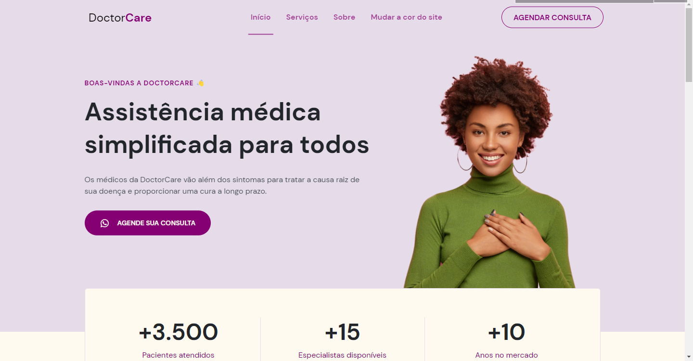

  <h1>Doctor Care</h1>

  Landing Page feita no evento online NLW Return da Rocketseat.

  <a href="#features">Features</a> -
  <a href="#tecnologias">Tecnologias</a> -
  <a href="#autor">Autor</a>

 

# Features

- [x] Animações de scroll.
- [x] Site responsivo.
- [x] Menu para dispositivos mobile.
- [x] Botão para voltar ao topo da página.
- [x] Mudar a cor de todo o site alearioriamente com um clique.

 

# Demo 🎥

<h1 align="center">
  
</h1>

---

## Tecnologias

- [HTML](https://developer.mozilla.org/pt-BR/docs/Web/HTML)
- [CSS](https://developer.mozilla.org/pt-BR/docs/Web/CSS)
- [Javascript (Vanilla)](https://developer.mozilla.org/pt-BR/docs/Web/javascript)
- [scrollreveal](https://scrollrevealjs.org/)

---

## Autor

Feito por Matheus Henrique 🚀 [Link do meu LinkedIn](https://www.linkedin.com/in/matheus-brauna-dev/)
